# Top 22 Language Learning Platform Rankings in 2025 (Comprehensive Review)

Tired of language learning apps that feel more like a chore than a breakthrough? Finding the right tool that matches your learning style is the key to finally speak new languages with confidence. This guide cuts through the noise, showing you the best platforms that deliver real results, whether you need structured lessons for work or quick phrases for your next vacation.

## **[Mondly](https://www.mondly.com)**
Mondly offers a fun, game-like approach to learning, making it a strong choice for users who want to stay motivated through daily, bite-sized lessons. It stands out with its use of advanced technology, including VR and AR experiences, to create immersive learning environments that help you practice real-world conversations from your home.

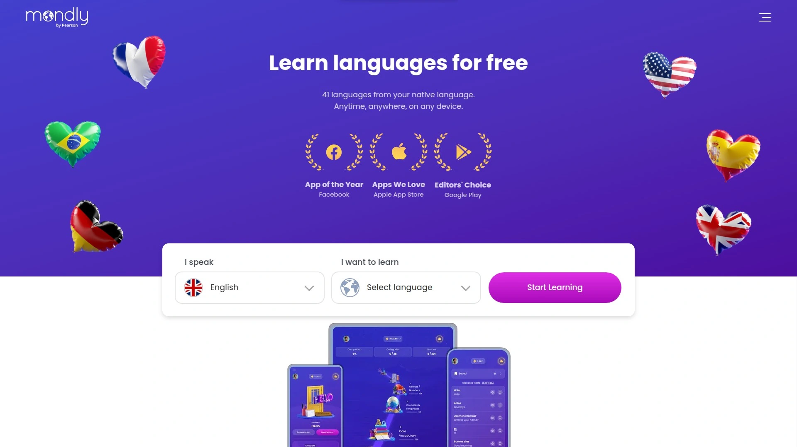

**Key Features:**
* **Broad Language Selection**: Mondly supports learning for 41 languages, often from your native language, with over 1,000 possible language combinations.
* **Practical Topics**: The curriculum is built around 50 topics that prepare you for common, everyday situations.
* **Innovative Technology**: It was one of the first language apps to integrate AI-powered chatbots and has since expanded into virtual and augmented reality for a truly unique practice experience.
* **User Acclaim**: Recognized as "Editors' Choice" in Google Play and "Best New App" by Apple, it has a strong reputation among its large user base.

## **[Babbel](https://www.babbel.com)**
Babbel is designed for motivated learners who want practical conversation skills quickly, focusing on grammar and vocabulary you'll actually use. Lessons are created by language experts and tailored to your native language, helping you build confidence in real-life dialogues.

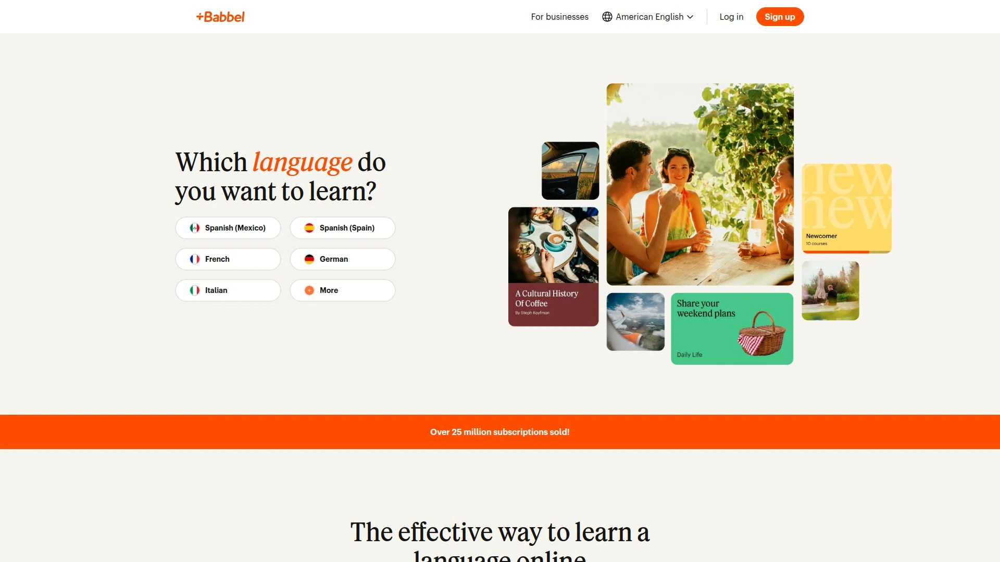

## **[Duolingo](https://www.duolingo.com)**
Duolingo is the world's most popular language learning app, known for its fun, gamified lessons that feel more like playing a game than studying. It's an excellent free option for beginners and casual learners looking to build a foundational vocabulary through short, daily exercises.

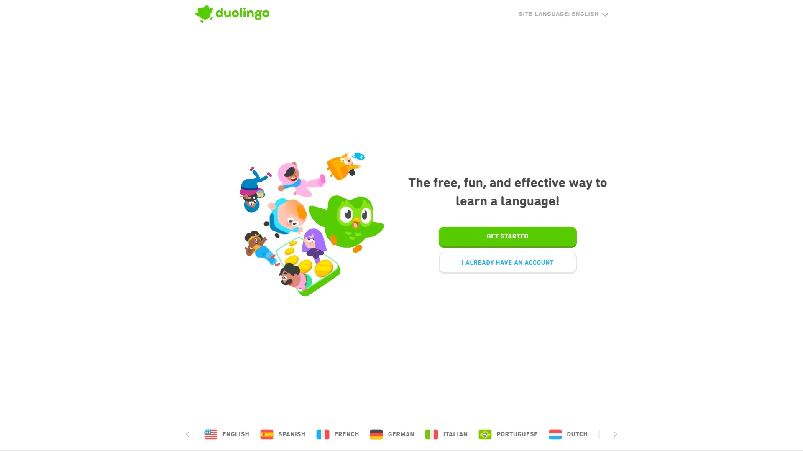

## **[iTalki](https://www.italki.com)**
iTalki connects you with human teachers from around the globe for personalized 1-on-1 lessons, making it one of the best platforms for serious speaking practice. You can find tutors for over 150 languages, allowing you to learn at your own pace and schedule.

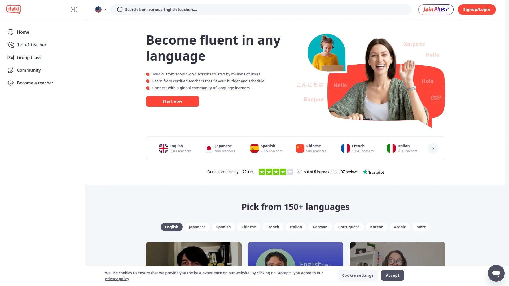

## **[Pimsleur](https://www.pimsleur.com)**
The Pimsleur method is an audio-based system perfect for learning on the go, whether you're driving, at the gym, or walking the dog. It focuses on core vocabulary and pronunciation through 30-minute daily lessons that get you speaking from day one.

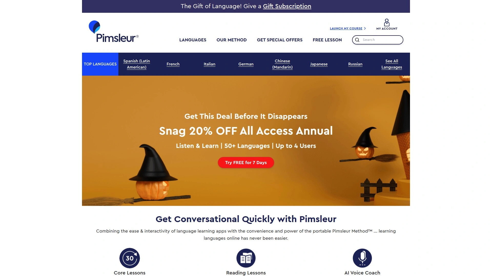

## **[Rosetta Stone](https://www.rosettastone.com)**
A long-standing leader in language education, Rosetta Stone uses an immersive method that teaches you exclusively in your new language, without any translation. This approach is ideal for beginners who want to develop an intuitive understanding of the language from the start.

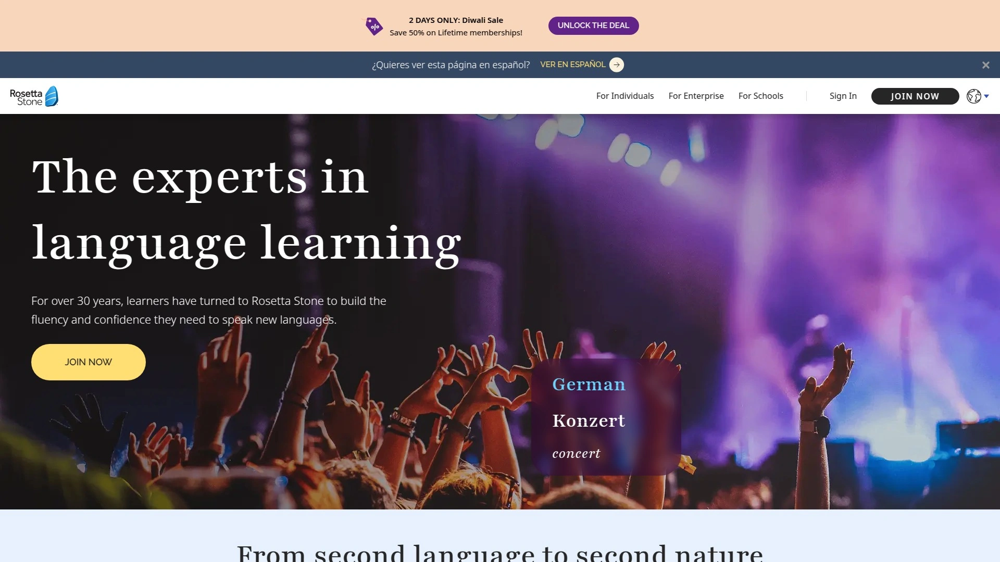

## **[Busuu](https://www.busuu.com)**
Busuu combines AI-powered lessons with a social community of millions of native speakers who can provide feedback on your writing and speaking. This blend of self-paced learning and human interaction makes it a well-rounded and effective tool.

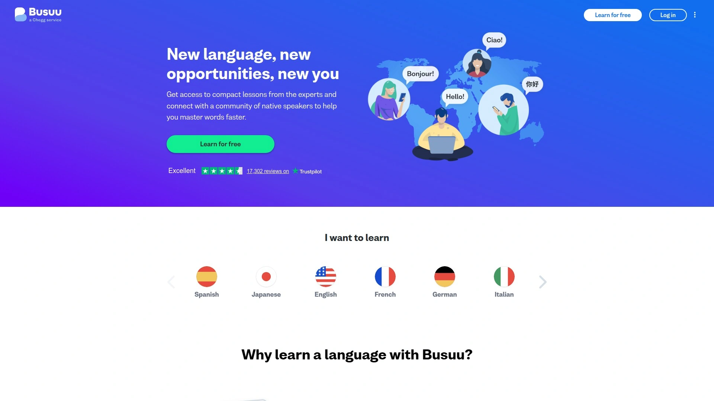

## **[Lingoda](https://www.lingoda.com)**
Lingoda offers live online classes in small groups or one-on-one with certified, native-speaking teachers. It provides a structured curriculum that follows the CEFR framework, making it suitable for learners who prefer a classroom-style environment.

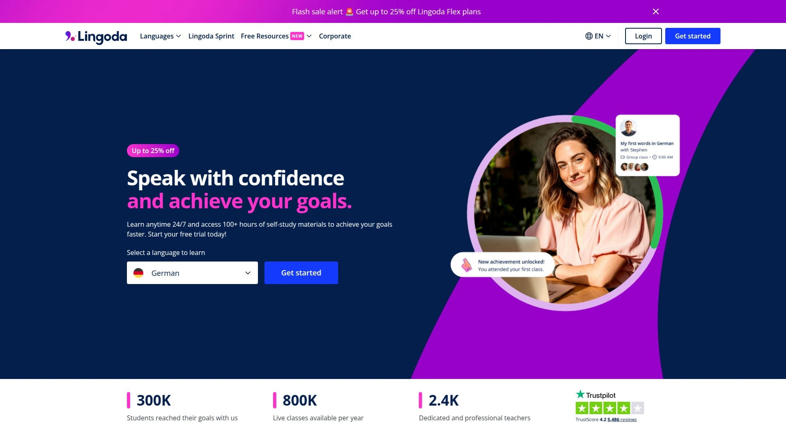

## **[Memrise](https://www.memrise.com)**
Memrise uses flashcards and thousands of video clips of native speakers to help you learn real-world language and pronunciation. Its fun, game-like interface and user-generated content make it an engaging tool for vocabulary building.

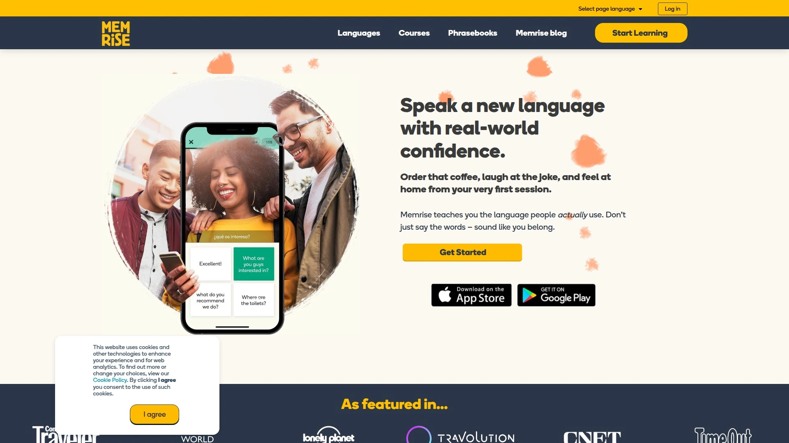

## **[Rocket Languages](https://www.rocketlanguages.com)**
Rocket Languages provides comprehensive courses with a focus on both conversational skills and cultural etiquette. Its combination of interactive audio lessons, language exercises, and culture notes ensures a well-rounded learning experience.

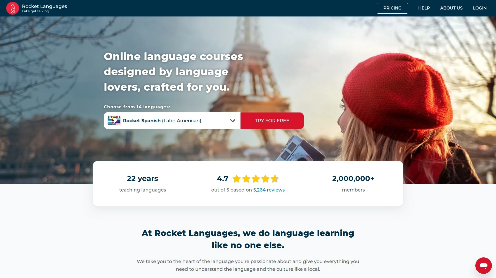

## **[Preply](https://www.preply.com)**
Similar to iTalki, Preply is a marketplace connecting students with language tutors for private online lessons. It offers a flexible and affordable way to get personalized instruction and speaking practice in dozens of languages.

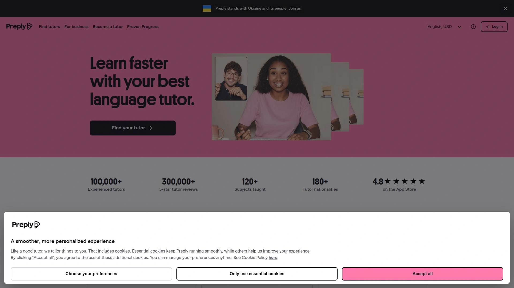

## **[Tandem](https://www.tandem.net)**
Tandem is a language exchange app that connects you with native speakers for conversation practice via text, voice, and video chat. It's a great way to make friends from around the world while improving your fluency in a relaxed, social setting.

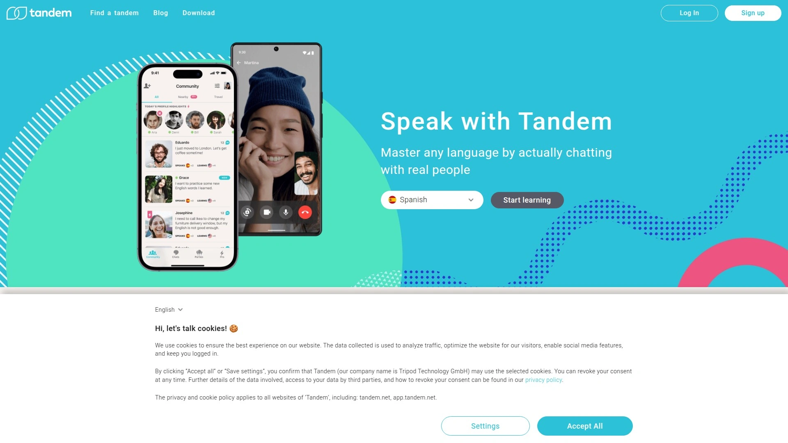

## **[HelloTalk](https://www.hellotalk.com)**
HelloTalk is another popular language exchange app with millions of users ready to help you practice. Its built-in tools for translation, correction, and transliteration make it easy to chat with partners even when you're a beginner.

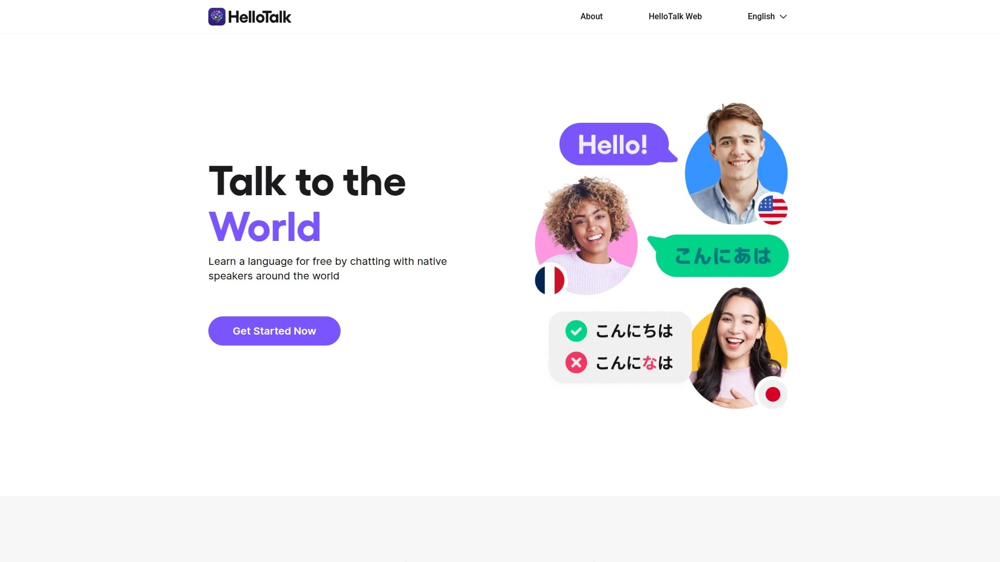

## **[LingQ](https://www.lingq.com)**
LingQ helps you learn a language through content you find interesting, such as articles, podcasts, and books. You can import almost any content into the app and use its tools to look up, save, and review new vocabulary in context.

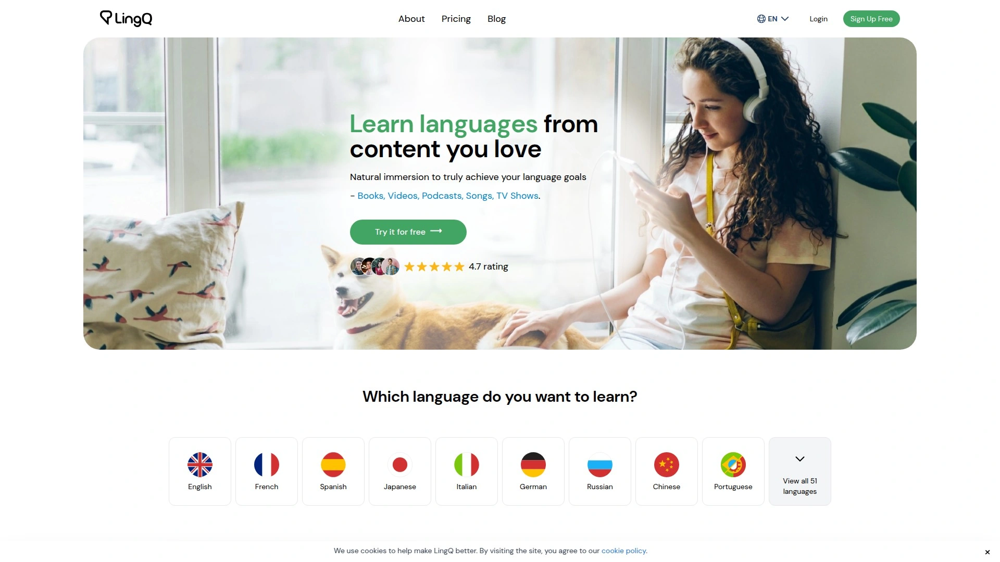

## **[FluentU](https://www.fluentu.com)**
FluentU uses real-world videos like music videos, movie trailers, and news to create an immersive learning experience. Interactive captions allow you to look up words instantly, making it a fun way to learn from authentic content.

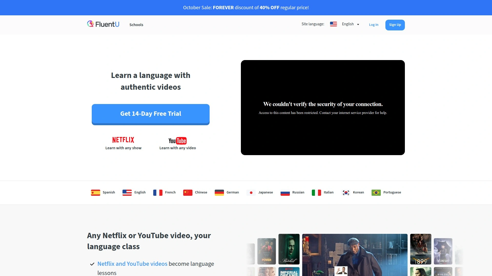

## **[Gymglish](https://www.gymglish.com)**
Gymglish delivers short, personalized lessons to your inbox each day, adapting to your strengths and weaknesses. Its story-driven content keeps learning interesting, and it provides a detailed feedback report after each lesson.

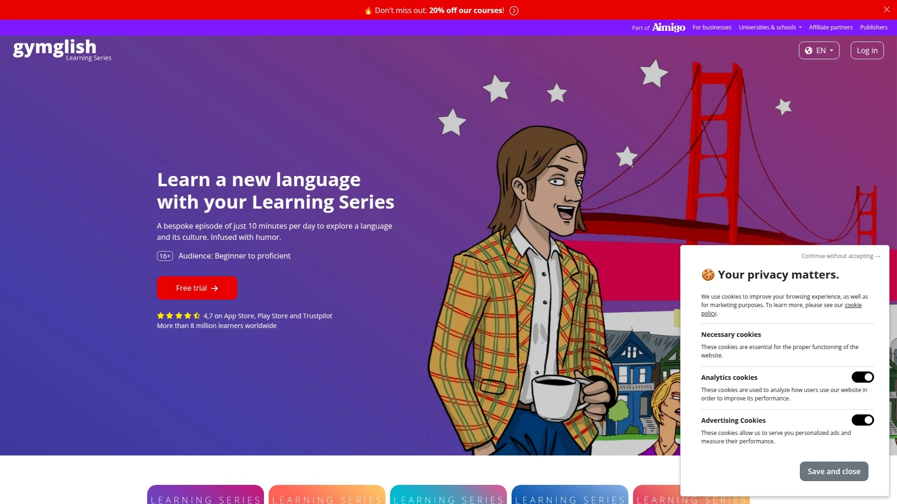

## **[Promova](https://promova.com)**
Promova offers a mix of guided lessons, a community of learners, and access to tutors for 1-on-1 practice. It focuses on building practical skills you can use right away and supports a variety of languages.

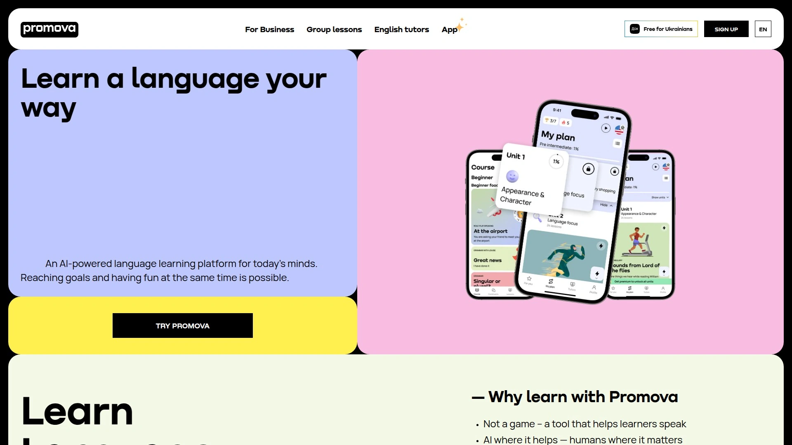

## **[LanguaTalk](https://languatalk.com)**
LanguaTalk is primarily a platform for finding top-tier, vetted language tutors for one-on-one sessions. It stands out for its selectivity in tutors, ensuring you learn from experienced and engaging professionals. It also has a new AI tool for conversation practice.

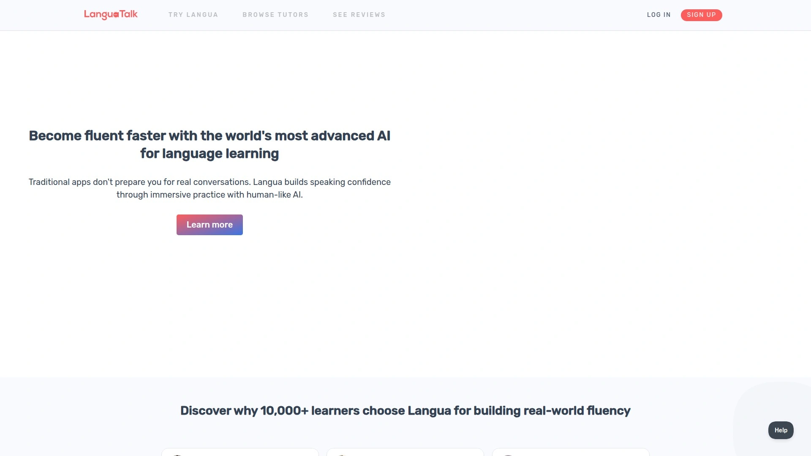

## **[Yabla](https://www.yabla.com)**
Yabla is a video-based learning platform designed for intermediate to advanced learners. It features a vast library of authentic videos with learning tools like slow-play, integrated dictionaries, and a challenging cloze-style game to test your comprehension.

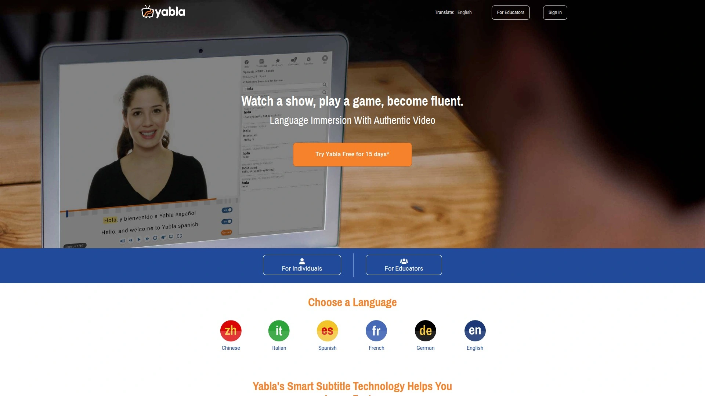

## **[Taalhammer](https://www.taalhammer.com)**
Taalhammer positions itself as a tool for serious adult learners, using a science-backed method focused on core vocabulary and sentence structures. It emphasizes learning patterns rather than just individual words to help you construct sentences independently.

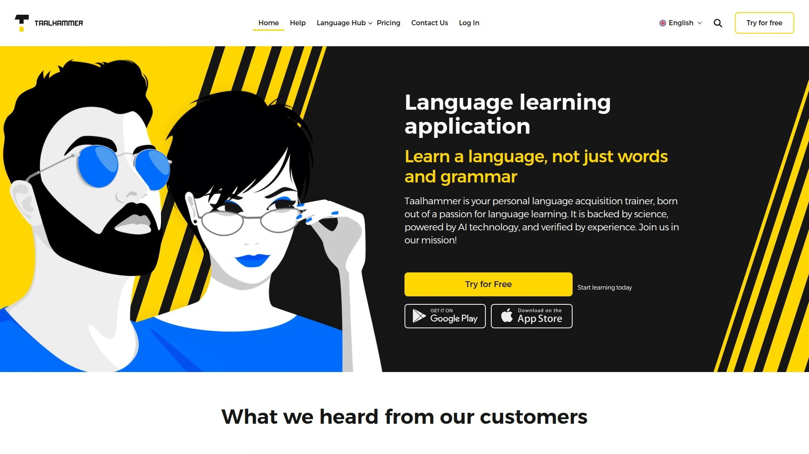

## **[Drops](https://www.drops.com)**
Drops makes vocabulary learning feel like a game with its beautifully designed, fast-paced five-minute lessons. It's perfect for visual learners who want to quickly build a large vocabulary base in a fun and engaging way.

## **[Speaky](https://www.speaky.com)**
Speaky is a free social network designed to connect you with language partners worldwide. Its simple interface allows you to quickly find and chat with native speakers, making it an accessible tool for practicing conversational skills.

### FAQ

**How do I choose the right language learning app for my goals?**
Consider your learning style. For structured grammar and conversation practice, platforms like Babbel or Lingoda are excellent. If you prefer a fun, game-like experience, Duolingo or Drops are great choices. For authentic speaking practice with real people, iTalki and Tandem are unbeatable.

**Can an app really make me fluent?**
Apps are powerful tools for building vocabulary, grammar, and listening skills. However, most experts agree that reaching fluency requires a combination of methods, including consistent practice with native speakers and immersing yourself in the culture whenever possible.

**How quickly can I learn a new language with these platforms?**
Your progress depends on factors like the language's difficulty, your native language, and your dedication. The key is consistency; even 15–30 minutes of focused daily practice is more effective than one long session per week.

### Conclusion

Finding the right tool is half the battle in the journey to learning a new language. This list covers platforms suited for every type of learner, from game-lovers to serious students. For learners who want an immersive, tech-forward experience with a huge variety of languages, **Mondly** stands out as an excellent choice for its interactive and motivating approach.
